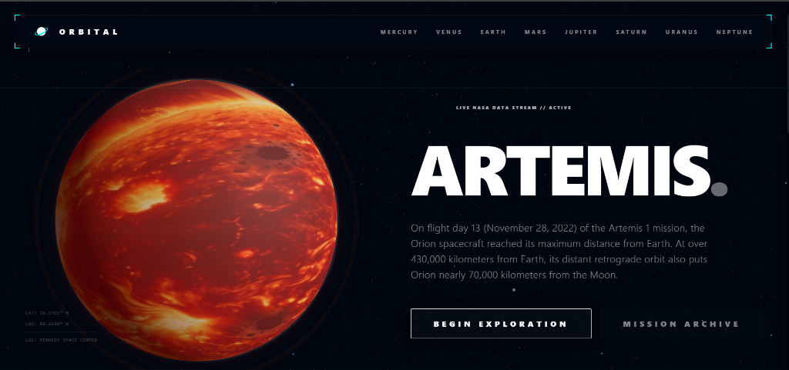
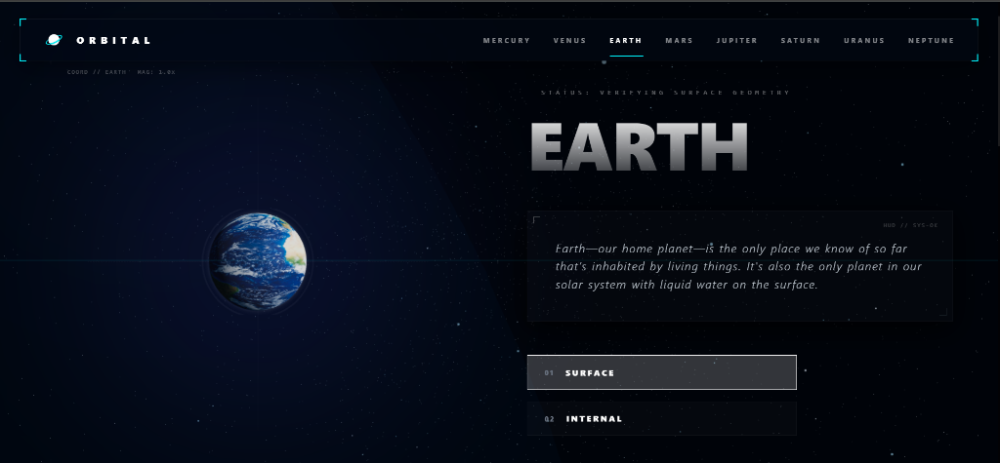
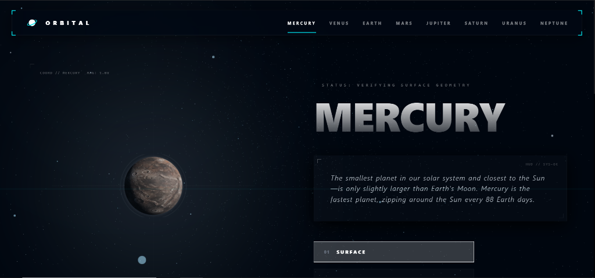
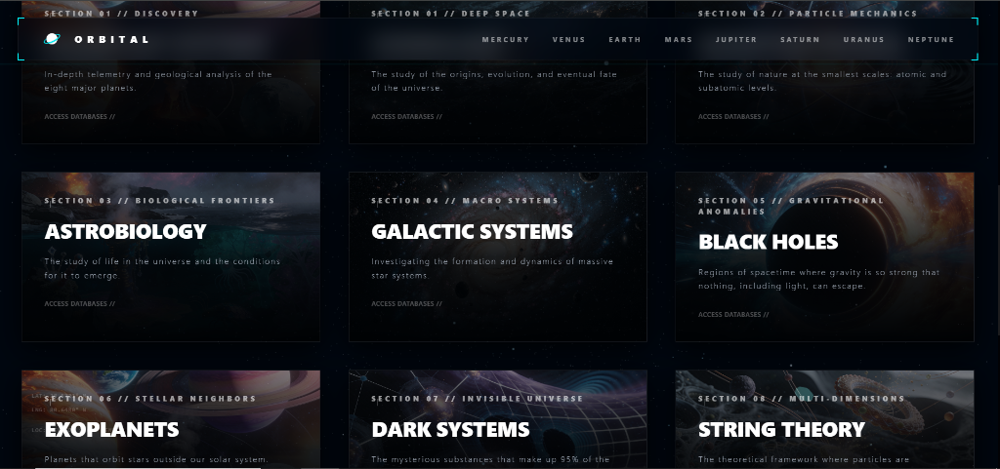

# ORBITAL - Space Exploration Hub

A stunning, interactive space exploration platform featuring professional 3D visualizations, scientific modules, and real-time cosmic effects.


<br />

<div align="center">
  <h1>📸 Mission Gallery</h1>
  <br />
  
  <br /><br />
  <div style="display: flex; gap: 10px; justify-content: center;">
    
    
  </div>
  <br />
  
</div>

<br />

## ✨ Features

### 📡 NASA Mission Control Data Streams
Real-time integration with specialized NASA endpoints for authentic scientific data:
- **NASA DONKI Feed**: Real-time solar weather (flares) and CME data.
- **NeoWS API**: Real-time Near Earth Object tracking and hazard analysis.
- **TechTransfer Patents**: Dynamic stream of patented NASA innovations.
- **NASA Image Library**: Live search and retrieval of historical mission archives.
- **Exoplanet Archive**: Remote telemetry from confirmed extrasolar worlds.

### 🌍 Interactive 3D Planet
- **Vibrant Shaders**: High-fidelity GLSL shaders with Fresnel atmospheric glow.
- **Dynamic Clouds**: Animated, distorted cloud layers for realistic orbital viewing.
- **Mission HUD**: Corner-decorated glass overlays for planet-specific data.

### 🎨 Premium Glass UI
- **Sub-pixel Glass-morphism**: Translucent, blurred navigation bars with saturate filters.
- **Themed Accents**: Cyan (`00f2ff`) and NASA Red (`#fc3d21`) visual rhythm.
- **Responsive Drawer**: Cinematic mobile menu with scale-in animations and mission indices.

## 🚀 Tech Stack

- **Frontend**: React 18, TypeScript
- **3D Graphics**: Three.js, @react-three/fiber, @react-three/drei
- **Animations**: GSAP
- **Styling**: Tailwind CSS, Custom CSS
- **Build Tool**: Vite
- **Routing**: Wouter

## 📦 Installation

Clone the repository:
```bash
git clone https://github.com/shanekizito/ReactPlanetFactsFrontend-.git
cd planets-facts-main
```

Install dependencies:
```bash
npm install --legacy-peer-deps
```

Run development server:
```bash
npm run dev
```

Build for production:
```bash
npm run build
```

## 🎯 Project Structure

```
src/
├── components/
│   ├── CosmicScene/      # 8000 stars, nebulas, shooting stars
│   ├── PlanetSphere/     # Professional 3D planet with shaders
│   ├── ParticleField/    # Interactive particle system
│   └── Navbar/           # Navigation component
├── views/
│   ├── Home/             # Landing page with hero & modules
│   ├── Module/           # Scientific module detail pages
│   └── Planet/           # Planet information pages
├── data/
│   ├── planetsData.ts    # Planet information
│   └── moduleData.ts     # Scientific module content
└── styles/
    └── index.css         # Global styles & utilities
```

## 🌟 Key Highlights

### Advanced 3D Techniques
- **Custom GLSL Shaders**: Fresnel effect for atmospheric glow
- **View-dependent Lighting**: Real-time camera position updates
- **Layered Architecture**: Core sphere, clouds, atmosphere, outer glow
- **High Polygon Count**: 128 segments for smooth appearance
- **MeshDistortMaterial**: Animated cloud layer

### Performance & Data Management
- **Intelligent Caching Layer**: In-memory response storage in `nasaService` for instant repeat visits.
- **Parallel Data Fetching**: Concurrent `Promise.allSettled` streams for "instant-load" planet views.
- **Adaptive Rendering**: 60fps performance through efficient particle and shader management.
- **LOD Management**: Optimized polygon counts for planetary spheres and star fields.

### Typography & Readability
- No word-breaking (`word-break: keep-all`)
- Optimized letter spacing and line height
- Responsive font sizes
- Improved text wrapping

## 🎨 Design Philosophy

ORBITAL combines scientific accuracy with stunning visual design:
- **Professional**: Clean, modern interface suitable for educational use
- **Interactive**: Mouse parallax, hover effects, 3D interactions
- **Informative**: Rich content with detailed scientific information
- **Performant**: Smooth 60fps animations and transitions

## 📱 Browser Support

- Chrome/Edge (recommended)
- Firefox
- Safari
- Requires WebGL support for 3D features

## 🤝 Contributing

Contributions are welcome! Please feel free to submit a Pull Request.

## 📄 License

This project is open source and available under the MIT License.

## 🙏 Acknowledgments

- Original concept inspired by FrontEnd Mentor challenge
- 3D techniques based on industry-standard practices
- Scientific content curated from reputable sources

---

**Built with ❤️ and Three.js**
